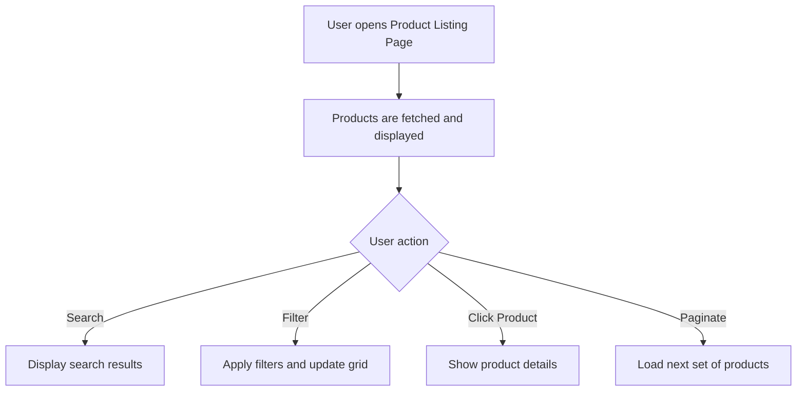

# Product Listing Page

## Introduction

Product Listing Page is a user-friendly web application designed to showcase products in a clean, organized, and interactive manner. It provides an efficient way for users to browse, filter, and view detailed information about various products. The project emphasizes responsive design and smooth user experience, making it suitable for e-commerce, catalog, or inventory display purposes.

## Features

- Responsive design for desktop and mobile devices
- Product grid and detailed view
- Sorting and filtering capabilities
- Search functionality to quickly locate products
- Pagination for better navigation across large product lists
- Modular and maintainable code structure
- Easy integration with APIs or static data sources

## Requirements

Before installing and running the Product Listing Page, ensure your environment meets these requirements:

- Node.js >= 14.x
- npm, yarn, pnpm, or bun for package management
- Modern web browser (for viewing the application)
- (Optional) API/server endpoint if fetching dynamic product data

## Installation

Follow these steps to set up and run the Product Listing Page locally:

1. Clone the repository:
    ```bash
    git clone https://github.com/KunalatGH/Product-Listing-Page.git
    cd Product-Listing-Page
    ```
2. Install the project dependencies using your preferred package manager:

    ```packagemanagers
    {
        "commands": {
            "npm": "npm install",
            "yarn": "yarn install",
            "pnpm": "pnpm install",
            "bun": "bun install"
        }
    }
    ```

3. Start the development server:
    ```bash
    npm start
    ```
4. Open your browser and navigate to `http://localhost:3000` (or specified port).

## Usage

Once the server is running, you can:

- Browse the product grid to view available items.
- Use the search bar to find products by keywords.
- Filter products by category, price, or other available attributes.
- Click on a product to view its details.
- Navigate through multiple pages using pagination controls.

### Example User Flow



## Configuration

You can customize various aspects of the Product Listing Page:

- **Data Source:** Configure the source of product data (static JSON, REST API, etc.) in the relevant configuration file or environment variable.
- **Display Settings:** Adjust columns, card styles, or grid layout via CSS or component props.
- **Filters and Sorting:** Add or modify filtering and sorting options by updating the relevant UI components and logic.
- **API Endpoints:** If integrating with an API, update the base URL and endpoints as needed.

### Example API Integration Block

If your setup uses a REST API to fetch products, an example endpoint might look like:

```api
{
    "title": "Get Product List",
    "description": "Fetches a paginated list of products with optional filters and search.",
    "method": "GET",
    "baseUrl": "https://api.example.com",
    "endpoint": "/products",
    "headers": [],
    "queryParams": [
        { "key": "search", "value": "Search term", "required": false },
        { "key": "category", "value": "Product category", "required": false },
        { "key": "sort", "value": "Sort order", "required": false },
        { "key": "page", "value": "Page number", "required": false }
    ],
    "pathParams": [],
    "bodyType": "none",
    "requestBody": "",
    "formData": [],
    "responses": {
        "200": {
            "description": "List of products",
            "body": "{\n  \"products\": [...],\n  \"total\": 100\n}"
        }
    }
}
```

## License

This project is licensed under the MIT License. You are free to use, modify, and distribute the code for personal or commercial purposes. Please see the [LICENSE](LICENSE) file for more details.
